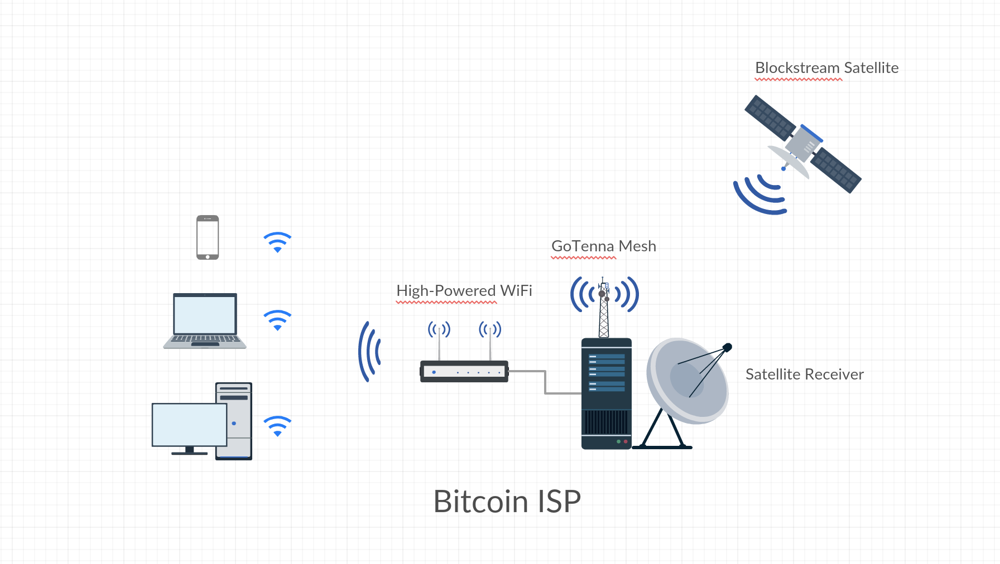

# btcstream
Portable satellite, high-powered Wifi, and goTenna enabled base station for:
* Receiving and rebroadcasting Blockstream Satellite data
* Providing initial block download
* Relaying Bitcoin transactions via mesh networking
* Serving an Esplora block explorer instance
* Serving critical binaries (Bitcoin Core, ABCore, etc.)

## Requirements

### Hardware 
* Satellite hardware (>= 45cm dish, appropriate LNB, SDR)
* WiFi access point 
* goTenna Mesh hardware
* Relatively modern computer with Ethernet NIC

### Software
* Blocksteam Satellite Receiver latest version
* Linux (Ubuntu or Xubuntu for ease of use / installation)
* `txtenna-python`
* Bitcoin FIBRE
* Esplora
* Nginx
* Ability to route packets Ethernet <-> WiFi AP (easy with Ubuntu / Xubuntu)
